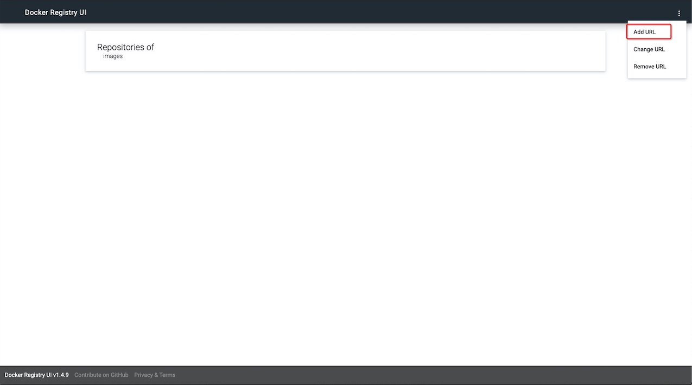
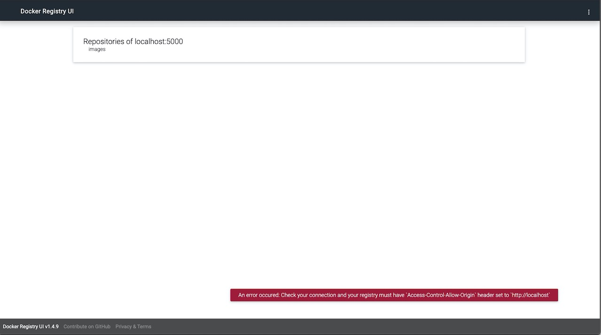
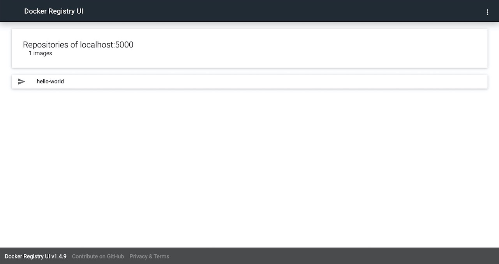

# docker-registry-ui
docker registry and ui

## directory structure

```
.
├── README.md
├── docker-compose.yml
├── registry-config
│   └── config.yml
├── registry-data
└── test.sh
```

## step 1: build images

```sh
docker-compose up -d
```

## step 2: 

http://localhost






